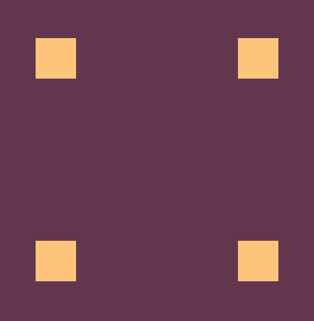

# CSS Battle challenges

some of the challenges performed on the CSS Battle platform

- Pilot Battle
  <table>
    <tr>
      <td align="center">
        <a href="./01-pilot-battle/ups-n-downs">
          
           
          
            <b>Ups n Downs</b>
          
        </a>
      </td>
      <td align="center">
        <a href="./01-pilot-battle/carrom">
          
           
          
            <b>Carrom</b>
          
        </a>
      </td>
      <td align="center">
        <a href="./01-pilot-battle/push-button">
          
           
          
            <b>Push Button</b>
          
        </a>
      </td>
      <td align="center">
        <a href="./01-pilot-battle/acid-rain">
          
           
          
            <b>Acid Rain</b>
          
        </a>
      </td>
    </tr>
    <tr>
      <td align="center">
        <a href="./01-pilot-battle/missing-slice">
          
           
          
            <b>Missing Slice</b>
          
        </a>
      </td>
    </tr>
  </table>
